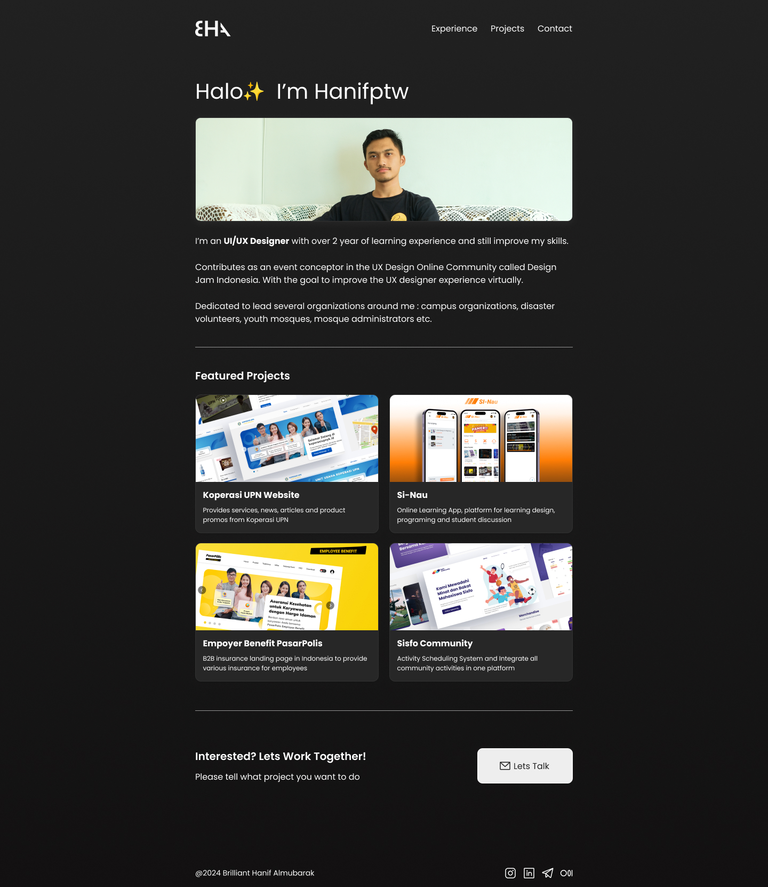
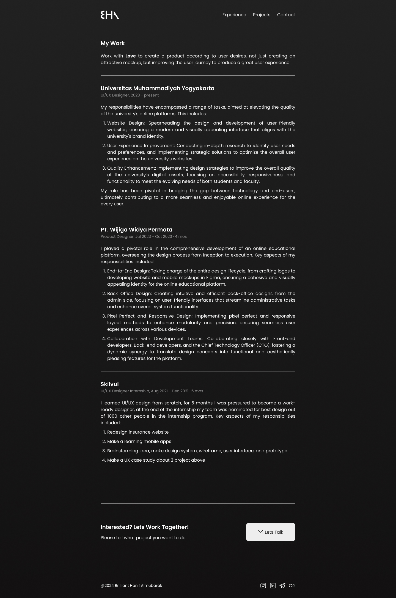
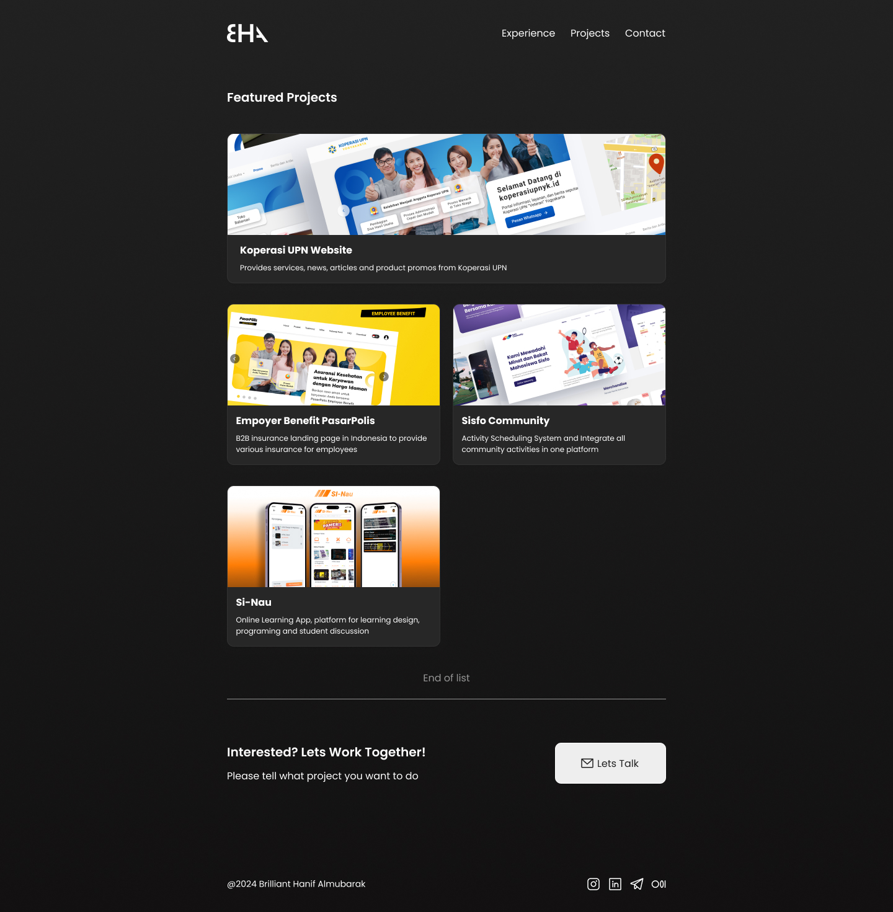
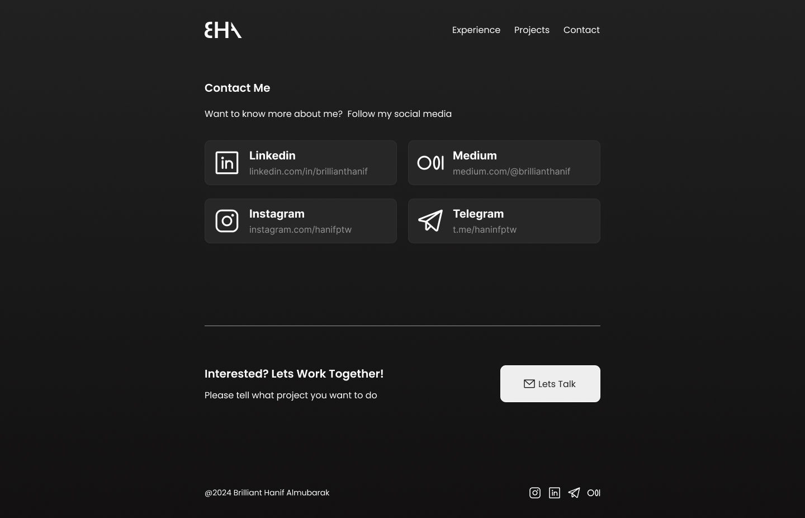

# My-Portofolio
Project 1 with [bearmentor](https://bearmentor.com/)

Also my beloved mentor all the time [M Haidar Hanif](https://www.linkedin.com/in/mhaidarhanif/) 

This project build portofolio using html and css basic, hope you can enjoy it :)

## Features
- Home (introduction)
- Experience (List of experience)
- Project (List of projects)
- contact (some way to contact)

## Preview

## Author
Brilliant Hanif Almubarak a.k.a. hanifptw

## Links
Email : <brillianthanif@gmail.com>

Instagram : [@hanifptw](http://instagram.com/hanifptw/)

medium    : [brillianthanif](http://medium.com/brillianthanif)

Telegram : [@hanifptw](http://t.me/hanifptw)

## References
[Lee Robinson](https://leerob.io/)
